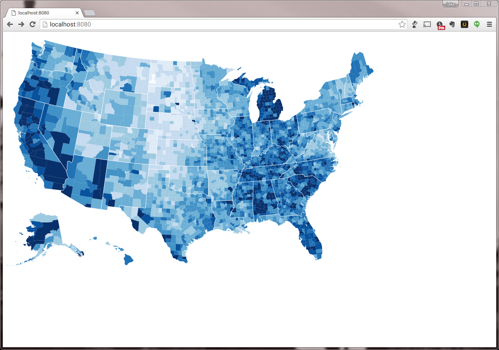

# d3-choropleth
A very slight modification of https://bl.ocks.org/mbostock/4060606, modified for simple development pedagogy in a local environment.

### How to Use This
Get it via git:
~~~bash
$ git clone https://github.com/jgysland/d3-choropleth
$ cd d3-choropleth
~~~
Or if you're new at this and you're getting some frustrating error about `git` not being a recognized command<small>†‡</small>, just download and unzip the [zip](https://github.com/jgysland/d3-choropleth/archive/master.zip) and then `cd` into whatever directory you unzipped it to.

Then run<small>‡</small>:
~~~bash
$ python -m SimpleHTTPServer 8080
~~~
and point your browser at [http://localhost:8080](http://localhost:8080).

Now go forth and tool around with the code!

##### I'm a newbie and I just want to play with this and some guy named Jake is babbling about too many things at once and I didn't understand how I'm supposed to fix problems getting this set up.
† If you're on a Mac and `git`'s not working, try installing [Homebrew](http://brew.sh). It includes `git` as a core part of its functionality and is generally very useful.

‡ If you're on Windows and you're having trouble with either `git` or `python` or both, try installing [Babun](http://babun.github.io), which will give you a much prettier terminal than Powershell or cmd and will include `git` and `python` and many other tools.

If it's something else and some guy named Jake is in the room babbling at you about something, tell him to shut up for a second and help you out. He'll happily comply.
